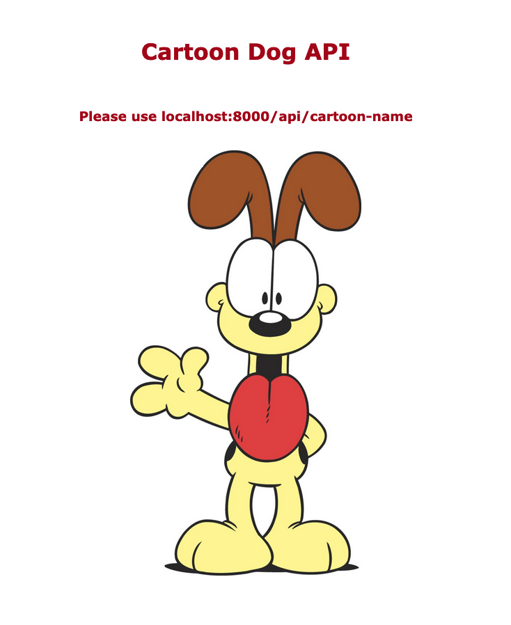
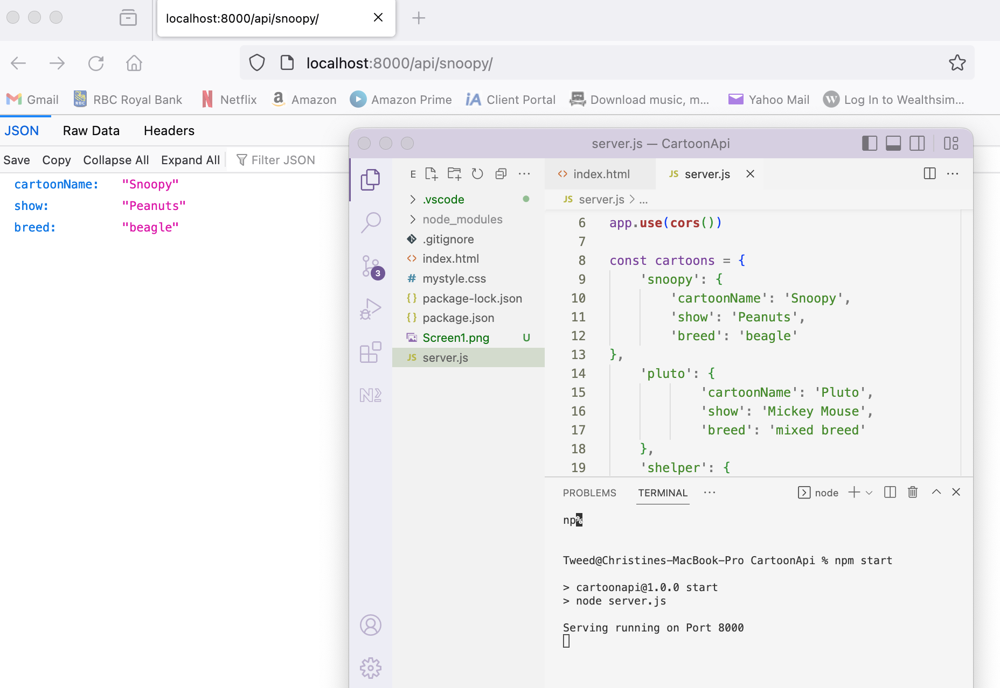

# cartoon dogs API

Remember to install npm install for node modules

## Steps to run project:

Clone this repository.

In your terminal, navigate to the cartoonDogs folder that is in the cloned repository.
Inside the CartoonDogs folder, run npm install to compile the source code for the project. 

Once the project compiles, in the same folder run npm run serve to run the project locally.

 If the command from step 4 is successful, two links will be seen. Local and Network IPs will be provided.
The local IP can be opened in the computer, it will be the localhost.
The Network IP is to access the web app from any other device that is in the same network 
as the machine running the project.

Project setup

Compiles project:
npm install

Runs project locally:
npm run serve
